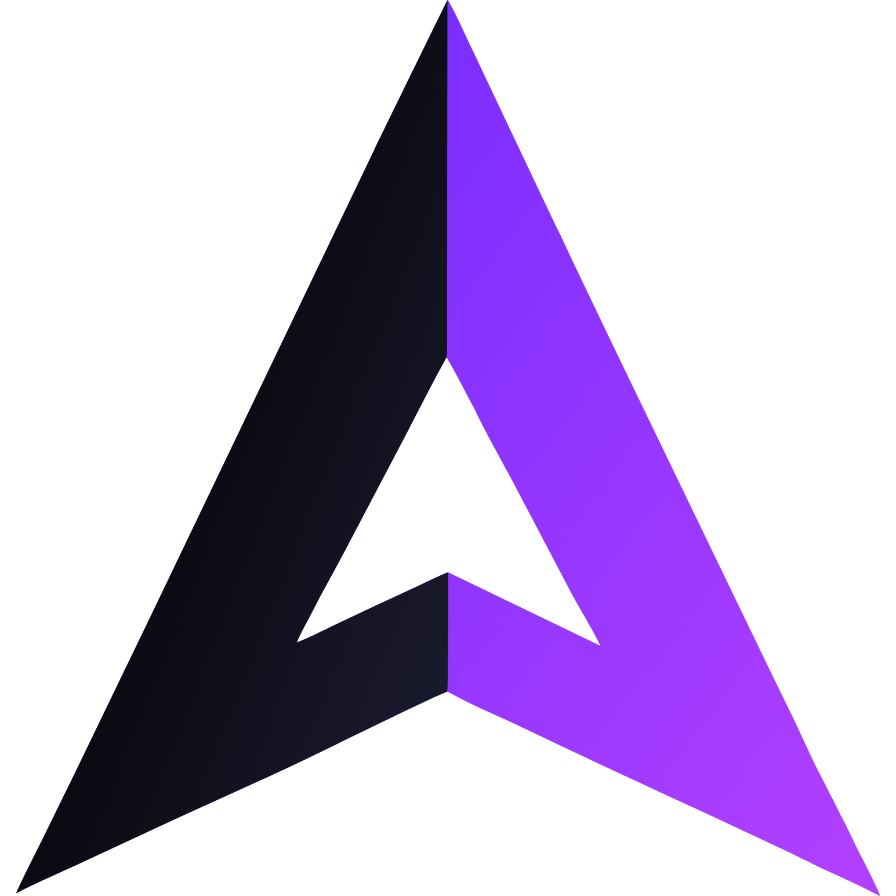
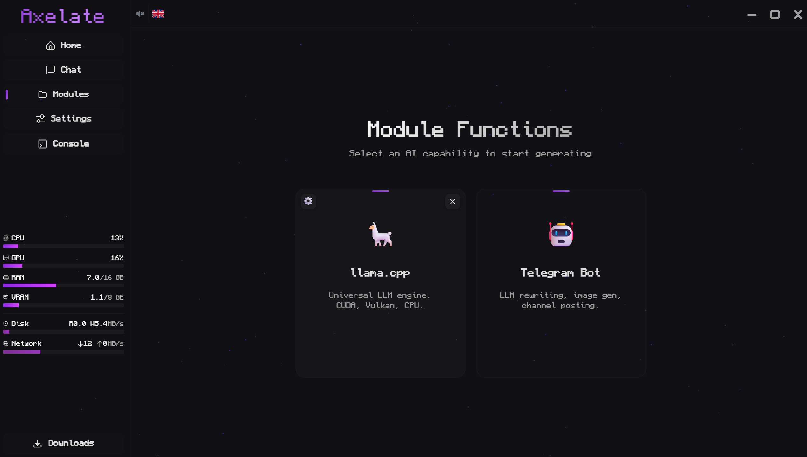
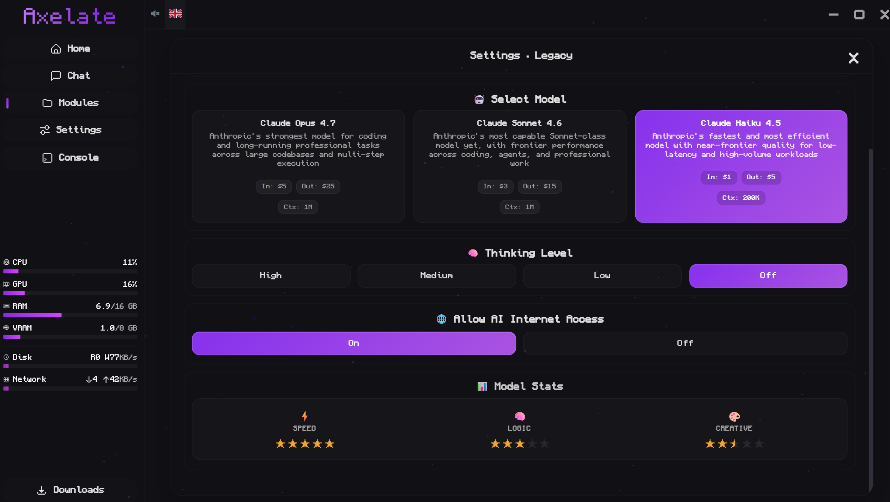

<div align="center">
  <br />
  
  <br />

  <h1 style="border-bottom: none; margin-bottom: 0;">Axelate</h1>
  <p style="font-size: 1.1em; color: #888; font-style: italic;">Windows-first AI Workstation</p>

  <br />

  <a href="https://github.com/F0RLE/Axelate/releases">
    
  </a>

  <br />
  <br />

  <p>
    
    &nbsp;
    
  </p>

  <br />
</div>

Axelate is currently a Windows-first desktop workstation for local AI runtimes, BYOK cloud models centered on OpenRouter, and one-shell access to logs, downloads, monitoring, settings, and runtime control.

It already includes:

- Rust + Tauri desktop backend
- vanilla TypeScript frontend
- streaming chat and persisted sessions
- OpenRouter-backed text and image flows
- local runtime and module lifecycle management
- downloads, console, monitoring, and settings surfaces
- backend-owned secure state

It is not yet a finished marketplace, managed platform, or polished MCP-first operating layer.

## Preview





## Quick Start

Install on Windows first:

- Node.js 20+
- npm 10+
- Rust stable
- WebView2 Runtime
- Windows SDK
- Microsoft C++ Build Tools with the `Desktop development with C++` workload

Then from the repository root:

```bash
npm run setup
npm run dev
```

The root `package.json` is a task runner. Frontend dependencies live in `src/node_modules`, not in a separate root `node_modules` tree.

Useful commands:

```bash
npm run doctor
npm run build
npm run tauri:build
npm run test
npm run typecheck
npm run lint
npm run verify
```

## Docs

Start here:

- [Getting Started](docs/en/GETTING_STARTED.md)
- [Development Workflow](docs/en/DEVELOPMENT_WORKFLOW.md)
- [Current State](docs/en/CURRENT_STATE.md)
- [Contributing](CONTRIBUTING.md)

Current reference:

- [Trust Model](docs/en/TRUST_MODEL.md)

Planning only:

- [Vision](docs/en/VISION.md)
- [Roadmap](docs/en/ROADMAP.md)

`Vision` and `Roadmap` are planning documents. They are not setup guides and should not be read as a promise that those features already ship today.

## Feedback

<div align="center">
  <a href="https://github.com/F0RLE/Axelate/issues"></a>
  &nbsp;
  <a href="https://github.com/F0RLE/Axelate/issues"></a>
</div>
